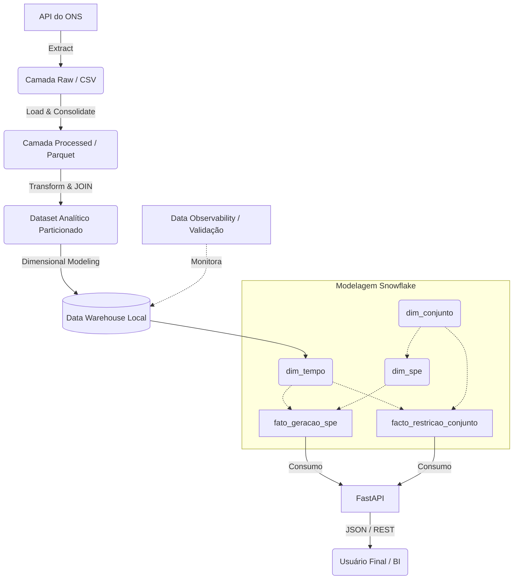

# Desafio Técnico: Engenharia de Dados - Casa dos Ventos

Este repositório contém a solução ponta a ponta para o desafio de Engenharia de Dados. O projeto consiste em um pipeline ELT (Extract, Load, Transform) construído em Python que consome dados da API do Operador Nacional do Sistema (ONS), processa regras de negócio do setor elétrico, constrói um Data Warehouse local e serve os dados através de uma API REST.

---

##  1. Arquitetura da Solução (Ambiente Local)

O fluxo de dados foi desenhado para ser modular, idempotente e resiliente. Abaixo está o diagrama da arquitetura implementada:



---

##  2. Premissas e Decisões de Design

* **Pandas vs. PySpark:** Dado o escopo do projeto (aprox. 10 milhões de linhas brutas que reduzem para < 1 milhão após filtros), a volumetria cabe na memória de uma máquina moderna. Optou-se pelo Pandas por sua velocidade de desenvolvimento e menor overhead computacional em ambiente local.
* **Armazenamento em Parquet:** A transição imediata de CSV para Parquet na camada processada garante tipagem estrita, compressão de dados significativa e leitura colunar otimizada para as agregações do modelo dimensional.
* **Modelo Dimensional Snowflake:** Optou-se por um schema Snowflake (onde a dimensão `dim_spe` se relaciona com a `dim_conjunto`) em vez de um Star Schema puro. Isso reflete a hierarquia estrita do setor eólico (Turbinas pertencem a Conjuntos) e evita a redundância massiva de dados (ex: repetir o Estado e Subsistema para cada uma das centenas de turbinas).
* **Garantia de Idempotência:** O particionamento de arquivos Parquet pode gerar dados duplicados se rodado múltiplas vezes. A solução implementou a biblioteca `shutil` para limpar agressivamente as partições de destino antes de cada write, garantindo idempotência absoluta sem a necessidade de comandos manuais.
* **FastAPI:** Escolhido sobre o Flask devido à sua performance nativa assíncrona, validação de tipos embutida com Pydantic e, principalmente, a geração automática de documentação interativa (Swagger/OpenAPI).
* **Data Observability:** Implementou-se um script de validação (`validacao.py`) no final do pipeline para garantir Qualidade de Dados. O script audita a recência (freshness), limites físicos (ex: vento > 40m/s) e a completude percentual das medições com base no calendário.

---

##  3. Instruções de Instalação e Execução

### Pré-requisitos
* Python 3.9 ou superior.
* Uma IDE (VS Code recomendado).

### Passo 1: Configuração do Ambiente
Clone o repositório e crie um ambiente virtual:
```bash
python -m venv venv
venv\Scripts\activate  # Windows
```

### Passo 2: Instalação das Dependências
Instale as bibliotecas necessárias para executar o projeto (certifique-se de ter um arquivo `requirements.txt` ou instale manualmente):
```bash
pip install pandas pyarrow fastparquet python-dotenv fastapi uvicorn requests
```

### Passo 3: Executar o Pipeline ELT
Na raiz do projeto, execute o orquestrador principal. Ele fará o download dos arquivos (se não existirem), construirá o Data Warehouse e rodará os testes de Qualidade de Dados:
```bash
python main.py
```
*(Você verá os logs de progresso e as validações de negócio no terminal).*

### Passo 4: Subir a API REST
Para consumir os dados gerados, inicie o servidor da API:
```bash
uvicorn src.api:app --reload
```

### Passo 5: Acessar a Documentação
Abra o seu navegador e acesse a interface interativa (Swagger) gerada automaticamente: 
 **http://127.0.0.1:8000/docs**

A partir dessa interface, você pode testar todos os endpoints (Projetos, Geração e Restrições) e aplicar os filtros de período e projeto diretamente na tela.